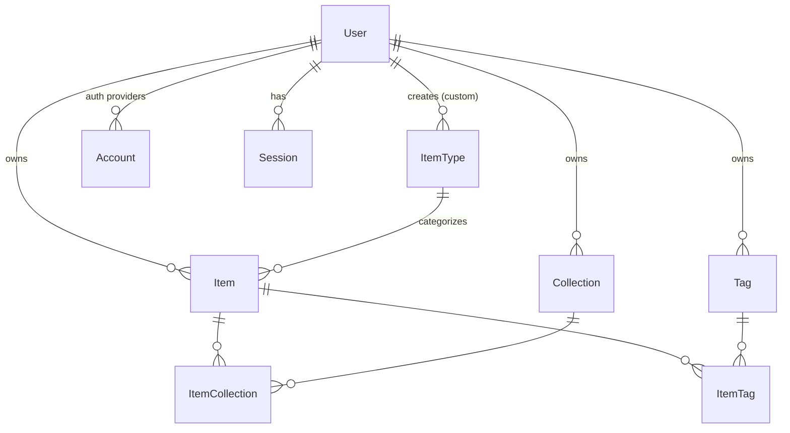
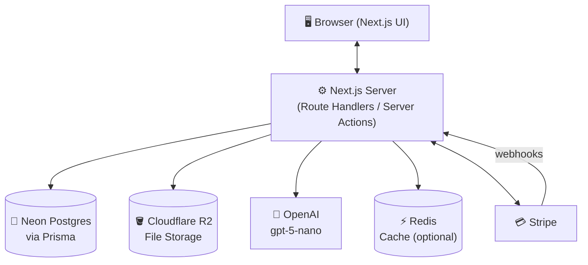
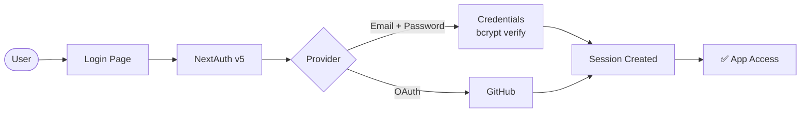
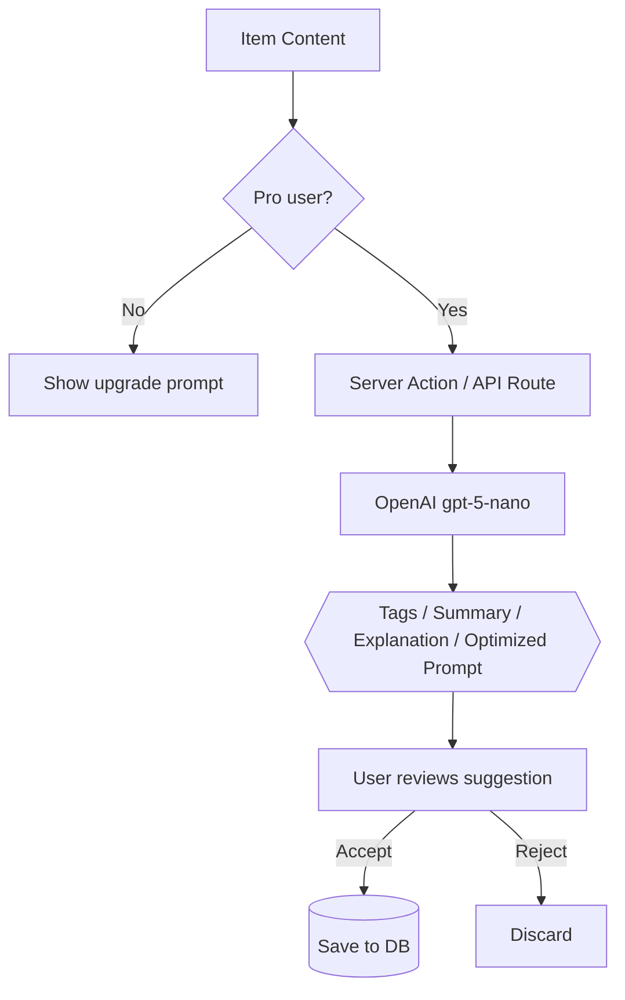
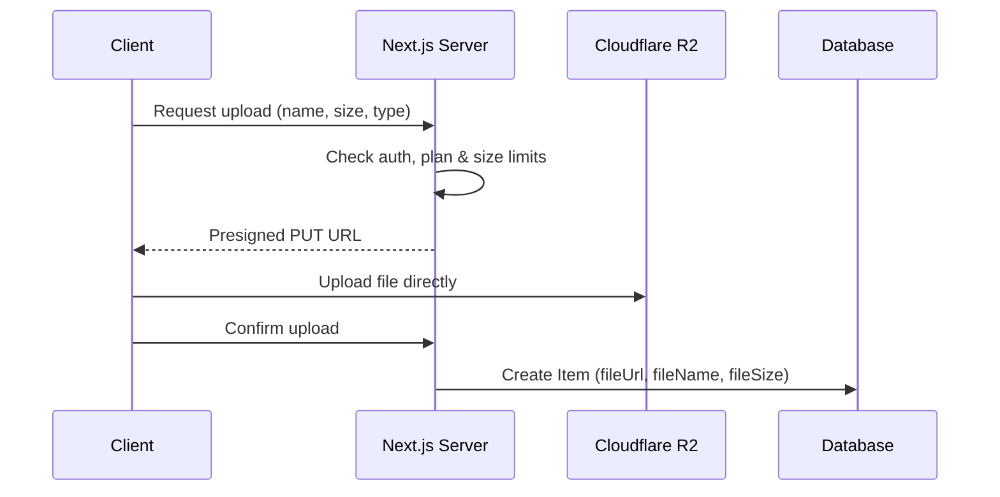
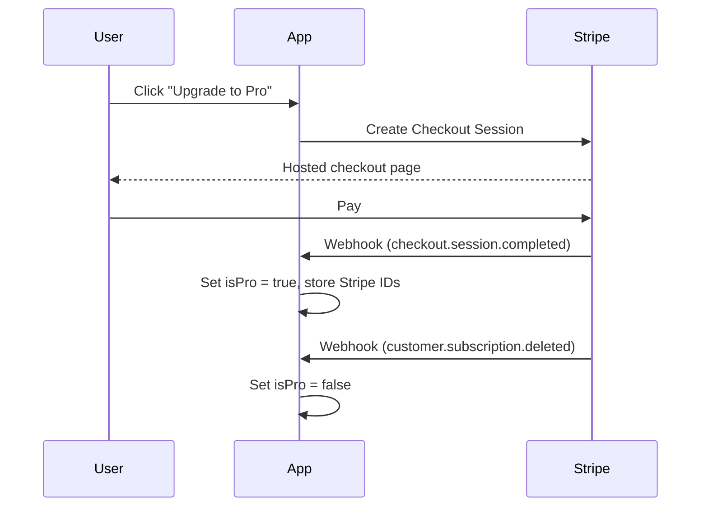

# 🗃️ DevStash — Project Overview

> **Store Smarter. Build Faster.**
> A centralized, AI‑enhanced knowledge hub for developers: code snippets, AI prompts, notes, commands, files, images and links, all in one searchable place.

|            |                                                                         |
| ---------- | ----------------------------------------------------------------------- |
| **Status** | 🟡 Planning → ready for environment setup & UI scaffolding              |
| **Type**   | SaaS (Free + Pro subscription)                                          |
| **Stack**  | Next.js · TypeScript · Prisma · Neon Postgres · Tailwind v4 · shadcn/ui |

---

## 📑 Table of Contents

1. [Problem](#-problem)
2. [Target Users](#-target-users)
3. [Core Features](#-core-features)
4. [Data Model](#️-data-model)
5. [Tech Stack](#-tech-stack)
6. [Architecture](#-architecture)
7. [Monetization](#-monetization)
8. [UI / UX](#-ui--ux)
9. [Development Workflow](#️-development-workflow)
10. [Roadmap](#-roadmap)
11. [Open Questions](#-open-questions)

---

## 📌 Problem

Developers keep their essentials scattered across many tools:

| What              | Where it usually lives        |
| ----------------- | ----------------------------- |
| Code snippets     | VS Code, Notion               |
| AI prompts        | Buried in chat histories      |
| Context files     | Spread across project folders |
| Useful links      | Browser bookmarks             |
| Docs              | Random folders                |
| Commands          | `.txt` files, bash history    |
| Project templates | GitHub Gists                  |

The result is **context switching**, **lost knowledge** and **inconsistent workflows**.

➡️ **DevStash gives developers ONE searchable, AI‑enhanced hub for all of it.**

---

## 🧑‍💻 Target Users

| Persona                           | Primary Needs                             |
| --------------------------------- | ----------------------------------------- |
| 👨‍💻 **Everyday Developer**         | Quick access to snippets, commands, links |
| 🤖 **AI‑First Developer**         | Store prompts, workflows, context files   |
| 🎓 **Content Creator / Educator** | Save course notes, reusable code          |
| 🏗️ **Full‑Stack Builder**         | Patterns, boilerplates, API references    |

---

## ✨ Core Features

### A) Items & Item Types

Every piece of saved knowledge is an **Item**. Each item has a **type**. The built‑in (system) types are:

| Type    | Icon ([Lucide](https://lucide.dev/icons)) | Color        | Content         | Example                               |
| ------- | ----------------------------------------- | ------------ | --------------- | ------------------------------------- |
| Snippet | `Code`                                    | `#3b82f6` 🔵 | Text            | A reusable `useDebounce` hook         |
| Prompt  | `Sparkles`                                | `#8b5cf6` 🟣 | Text            | "Review this PR for security issues…" |
| Note    | `StickyNote`                              | `#fde047` 🟡 | Text (Markdown) | Notes on a library's quirks           |
| Command | `Terminal`                                | `#f97316` 🟠 | Text            | `docker compose up -d --build`        |
| File    | `File`                                    | `#6b7280` ⚪ | File upload     | `CLAUDE.md`, boilerplate config       |
| Image   | `Image`                                   | `#ec4899` 🩷 | File upload     | Architecture diagram screenshot       |
| URL     | `Link`                                    | `#10b981` 🟢 | URL             | Link to a docs page                   |

- System types are shared across all users and can't be edited.
- **Pro** users can create **custom types** with their own name, icon and color.

### B) Collections

Collections group items. A collection can hold **mixed item types**, and an item can belong to **more than one collection**.

Examples: `React Patterns`, `Context Files`, `Python Snippets`, `Interview Prep`

### C) Search

Full‑text search across **titles**, **content**, **tags** and **types**, with filters for type, collection, tag and favorites.

### D) Authentication

- Email + password
- GitHub OAuth

### E) Productivity Features

- ⭐ Favorites and 📌 pinned items
- 🕘 Recently used
- 📥 Import from files
- 📝 Markdown editor for text items
- 🎨 Syntax highlighting for code
- 📎 File uploads (images, docs, templates)
- 📤 Export (JSON / ZIP)
- 🌙 Dark mode by default

### F) AI Features (Pro)

| Feature                    | Description                                      |
| -------------------------- | ------------------------------------------------ |
| 🏷️ **Auto‑tagging**        | Suggest tags based on item content               |
| 📄 **AI Summaries**        | Generate a short description for long items      |
| 🧠 **Explain Code**        | Plain‑English explanation of a snippet           |
| ⚡ **Prompt Optimization** | Rewrite prompts to be clearer and more effective |

> AI is powered by **OpenAI `gpt-5-nano`**, chosen for low cost and fast responses.

---

## 🗄️ Data Model

> ⚠️ A starting point that **will evolve**. Uses [Prisma](https://www.prisma.io/docs/orm/prisma-schema) with PostgreSQL on [Neon](https://neon.tech/docs).

### Entity Relationship Diagram


```mermaid
erDiagram
  User ||--o{ Item : owns
  User ||--o{ Collection : owns
  User ||--o{ ItemType : "creates (custom)"
  User ||--o{ Tag : owns
  User ||--o{ Account : "auth providers"
  User ||--o{ Session : has
  ItemType ||--o{ Item : categorizes
  Item ||--o{ ItemCollection : ""
  Collection ||--o{ ItemCollection : ""
  Item ||--o{ ItemTag : ""
  Tag ||--o{ ItemTag : ""
```

### Prisma Schema

```prisma
generator client {
  provider = "prisma-client-js"
}

datasource db {
  provider = "postgresql"
  url      = env("DATABASE_URL")
}

// ─────────────────────────────────────────────
// Users & Auth (NextAuth / Auth.js Prisma adapter)
// ─────────────────────────────────────────────

model User {
  id                   String    @id @default(cuid())
  name                 String?
  email                String    @unique
  emailVerified        DateTime?
  image                String?
  password             String?   // hashed (bcrypt); null for OAuth-only users

  // Billing
  isPro                Boolean   @default(false)
  stripeCustomerId     String?   @unique
  stripeSubscriptionId String?   @unique

  items       Item[]
  itemTypes   ItemType[]
  collections Collection[]
  tags        Tag[]
  accounts    Account[]
  sessions    Session[]

  createdAt DateTime @default(now())
  updatedAt DateTime @updatedAt
}

model Account {
  id                String  @id @default(cuid())
  userId            String
  type              String
  provider          String
  providerAccountId String
  refresh_token     String? @db.Text
  access_token      String? @db.Text
  expires_at        Int?
  token_type        String?
  scope             String?
  id_token          String? @db.Text
  session_state     String?

  user User @relation(fields: [userId], references: [id], onDelete: Cascade)

  @@unique([provider, providerAccountId])
}

model Session {
  id           String   @id @default(cuid())
  sessionToken String   @unique
  userId       String
  expires      DateTime

  user User @relation(fields: [userId], references: [id], onDelete: Cascade)
}

model VerificationToken {
  identifier String
  token      String   @unique
  expires    DateTime

  @@unique([identifier, token])
}

// ─────────────────────────────────────────────
// Core Domain
// ─────────────────────────────────────────────

enum ContentType {
  TEXT // snippet, prompt, note, command
  FILE // file, image
  URL  // url
}

model Item {
  id          String      @id @default(cuid())
  title       String
  description String?
  contentType ContentType

  content  String? @db.Text // TEXT items
  fileUrl  String?          // FILE items (Cloudflare R2 key/URL)
  fileName String?
  fileSize Int?             // bytes
  url      String?          // URL items
  language String?          // syntax highlighting, e.g. "typescript"

  isFavorite Boolean   @default(false)
  isPinned   Boolean   @default(false)
  lastUsedAt DateTime? // powers "Recently used"

  userId String
  user   User   @relation(fields: [userId], references: [id], onDelete: Cascade)

  typeId String
  type   ItemType @relation(fields: [typeId], references: [id])

  collections ItemCollection[]
  tags        ItemTag[]

  createdAt DateTime @default(now())
  updatedAt DateTime @updatedAt

  @@index([userId])
  @@index([userId, typeId])
  @@index([userId, lastUsedAt])
}

model ItemType {
  id       String  @id @default(cuid())
  name     String
  icon     String? // Lucide icon name
  color    String? // hex
  isSystem Boolean @default(false)

  userId String? // null for system types
  user   User?   @relation(fields: [userId], references: [id], onDelete: Cascade)

  items Item[]

  @@unique([userId, name])
}

model Collection {
  id          String  @id @default(cuid())
  name        String
  description String?
  isFavorite  Boolean @default(false)

  userId String
  user   User   @relation(fields: [userId], references: [id], onDelete: Cascade)

  items ItemCollection[]

  createdAt DateTime @default(now())
  updatedAt DateTime @updatedAt

  @@index([userId])
}

model ItemCollection {
  itemId       String
  collectionId String
  addedAt      DateTime @default(now())

  item       Item       @relation(fields: [itemId], references: [id], onDelete: Cascade)
  collection Collection @relation(fields: [collectionId], references: [id], onDelete: Cascade)

  @@id([itemId, collectionId])
  @@index([collectionId])
}

model Tag {
  id     String @id @default(cuid())
  name   String
  userId String
  user   User   @relation(fields: [userId], references: [id], onDelete: Cascade)

  items ItemTag[]

  @@unique([userId, name])
}

model ItemTag {
  itemId String
  tagId  String

  item Item @relation(fields: [itemId], references: [id], onDelete: Cascade)
  tag  Tag  @relation(fields: [tagId], references: [id], onDelete: Cascade)

  @@id([itemId, tagId])
  @@index([tagId])
}
```

### Changes from the original draft

| Change                                               | Why                                                                                                      |
| ---------------------------------------------------- | -------------------------------------------------------------------------------------------------------- |
| Added `Account`, `Session`, `VerificationToken`      | Required by the [Auth.js Prisma adapter](https://authjs.dev/getting-started/adapters/prisma)             |
| Added `name`, `image`, `emailVerified` to `User`     | Populated by GitHub OAuth and email verification                                                         |
| `contentType` is now an `enum`                       | Type safety instead of a free‑form string                                                                |
| Item ↔ Collection is many‑to‑many (`ItemCollection`) | Lets an item live in several collections, e.g. one snippet in both "React Patterns" and "Interview Prep" |
| `onDelete: Cascade` on user‑owned relations          | Deleting a user or item cleans up related rows                                                           |
| `@@unique([userId, name])` on `Tag` and `ItemType`   | Prevents duplicate tag/type names per user                                                               |
| Added `lastUsedAt` and indexes                       | Supports "Recently used" and fast per‑user queries                                                       |
| `@db.Text` on `content`                              | Long snippets and notes                                                                                  |

> 💡 **Search:** start with Postgres full‑text search (`tsvector` + GIN index via a raw migration). Consider `pg_trgm` for fuzzy matching later.

---

## 🧱 Tech Stack

| Category      | Choice                                           | Docs                                                                         |
| ------------- | ------------------------------------------------ | ---------------------------------------------------------------------------- |
| Framework     | **Next.js** (App Router, React 19)               | [nextjs.org/docs](https://nextjs.org/docs)                                   |
| Language      | **TypeScript**                                   | [typescriptlang.org](https://www.typescriptlang.org/docs/)                   |
| Database      | **Neon** (serverless PostgreSQL)                 | [neon.tech/docs](https://neon.tech/docs)                                     |
| ORM           | **Prisma**                                       | [prisma.io/docs](https://www.prisma.io/docs)                                 |
| Caching       | **Redis** (optional, e.g. Upstash)               | [upstash.com/docs](https://upstash.com/docs/redis)                           |
| File Storage  | **Cloudflare R2** (S3‑compatible)                | [developers.cloudflare.com/r2](https://developers.cloudflare.com/r2/)        |
| Styling       | **Tailwind CSS v4**                              | [tailwindcss.com/docs](https://tailwindcss.com/docs)                         |
| UI Components | **shadcn/ui**                                    | [ui.shadcn.com](https://ui.shadcn.com)                                       |
| Auth          | **NextAuth v5 / Auth.js** (Credentials + GitHub) | [authjs.dev](https://authjs.dev)                                             |
| AI            | **OpenAI `gpt-5-nano`**                          | [platform.openai.com/docs](https://platform.openai.com/docs)                 |
| Payments      | **Stripe** (Subscriptions + Webhooks)            | [stripe.com/docs/billing](https://stripe.com/docs/billing)                   |
| Deployment    | **Vercel**                                       | [vercel.com/docs](https://vercel.com/docs)                                   |
| Monitoring    | **Sentry** (later)                               | [docs.sentry.io](https://docs.sentry.io/platforms/javascript/guides/nextjs/) |

---

## 🔌 Architecture

### System Overview


```mermaid
graph TD
  Client["🖥️ Browser (Next.js UI)"] <--> API["⚙️ Next.js Server<br/>(Route Handlers / Server Actions)"]
  API --> DB[("🐘 Neon Postgres<br/>via Prisma")]
  API --> R2[("🪣 Cloudflare R2<br/>File Storage")]
  API --> AI["🤖 OpenAI<br/>gpt-5-nano"]
  API --> Cache[("⚡ Redis<br/>Cache (optional)")]
  API <--> Stripe["💳 Stripe"]
  Stripe -- webhooks --> API
```

### 🔐 Auth Flow


```mermaid
flowchart LR
  User([User]) --> Login[Login Page]
  Login --> NextAuth[NextAuth v5]
  NextAuth --> Providers{Provider}
  Providers -->|Email + Password| Credentials[Credentials<br/>bcrypt verify]
  Providers -->|OAuth| GitHub[GitHub]
  Credentials --> Session[Session Created]
  GitHub --> Session
  Session --> App[✅ App Access]
```

### 🧠 AI Feature Flow


```mermaid
flowchart TD
  Item[Item Content] --> Check{Pro user?}
  Check -->|No| Upsell[Show upgrade prompt]
  Check -->|Yes| API[Server Action / API Route]
  API --> OpenAI[OpenAI gpt-5-nano]
  OpenAI --> Result{{Tags / Summary / Explanation / Optimized Prompt}}
  Result --> Review[User reviews suggestion]
  Review -->|Accept| Save[(Save to DB)]
  Review -->|Reject| Discard[Discard]
```

### 📎 File Upload Flow


```mermaid
sequenceDiagram
  participant C as Client
  participant S as Next.js Server
  participant R as Cloudflare R2
  participant D as Database
  C->>S: Request upload (name, size, type)
  S->>S: Check auth, plan & size limits
  S-->>C: Presigned PUT URL
  C->>R: Upload file directly
  C->>S: Confirm upload
  S->>D: Create Item (fileUrl, fileName, fileSize)
```

### 💳 Billing Sync


```mermaid
sequenceDiagram
  participant U as User
  participant A as App
  participant S as Stripe
  U->>A: Click "Upgrade to Pro"
  A->>S: Create Checkout Session
  S-->>U: Hosted checkout page
  U->>S: Pay
  S->>A: Webhook (checkout.session.completed)
  A->>A: Set isPro = true, store Stripe IDs
  S->>A: Webhook (customer.subscription.deleted)
  A->>A: Set isPro = false
```

---

## 💰 Monetization

|                         | 🆓 **Free** | ⭐ **Pro**                         |
| ----------------------- | ----------- | ---------------------------------- |
| **Price**               | $0          | **$8/mo** or **$72/yr** (save 25%) |
| **Items**               | 50          | Unlimited                          |
| **Collections**         | 3           | Unlimited                          |
| **Search**              | Basic       | Full                               |
| **Image uploads**       | ✅          | ✅                                 |
| **File uploads**        | ❌          | ✅                                 |
| **Custom item types**   | ❌          | ✅                                 |
| **AI features**         | ❌          | ✅                                 |
| **Export (JSON / ZIP)** | ❌          | ✅                                 |

> Stripe Checkout handles subscriptions, Stripe Customer Portal handles plan management, and webhooks keep `isPro` in sync.

---

## 🎨 UI / UX

### Principles

- 🌙 Dark mode first
- ✂️ Minimal, developer‑friendly interface
- 🎨 Syntax highlighting for code (e.g. [Shiki](https://shiki.style))
- ⌨️ Keyboard friendly (command palette / quick search)
- 💡 Inspired by [Notion](https://notion.so), [Linear](https://linear.app), [Raycast](https://raycast.com)

### Design References

- [Notion](https://notion.so)
- Clean organization
- [Linear](https://linear.app)
- Modern dev aesthetic
- [Raycast](https://raycast.com)
- quick access patterns

### Screenshots

Refer to screenshots below for a base for the dashboard
UI. It doesn't have to be exact. Use it as a guide.

- @context/screenshots/dashboard-ui-drawer.png
- @context/screenshots/dashboard-ui-main.png

### Layout

```
┌──────────────────────────────────────────────────────────────┐
│  🔍 Search…                                   [+ New]  👤    │
├───────────────┬──────────────────────────────────────────────┤
│ ⭐ Favorites   │                                              │
│ 🕘 Recent      │   ┌──────────┐ ┌──────────┐ ┌──────────┐     │
│               │   │ Snippet  │ │ Prompt   │ │ Command  │     │
│ TYPES         │   │ useAuth  │ │ PR Review│ │ docker…  │     │
│  </> Snippets │   └──────────┘ └──────────┘ └──────────┘     │
│  ✨ Prompts    │   ┌──────────┐ ┌──────────┐ ┌──────────┐     │
│  📝 Notes      │   │ Note     │ │ URL      │ │ Image    │     │
│  >_ Commands  │   │ …        │ │ …        │ │ …        │     │
│  📄 Files      │   └──────────┘ └──────────┘ └──────────┘     │
│  🖼️ Images     │                                              │
│  🔗 URLs       │          Main workspace (grid / list)        │
│               │                                              │
│ COLLECTIONS   │                                              │
│  React Patt…  │                                              │
│  Context Fi…  │                                              │
├───────────────┘                                              │
│  « collapse                                                  │
└──────────────────────────────────────────────────────────────┘
```

- **Collapsible sidebar**: filters, item types and collections
- **Main workspace**: grid or list of items, color‑coded by type
- **Item editor**: full‑screen editor (Markdown / code)

### Responsive

- 📱 Sidebar becomes a mobile drawer
- 👆 Touch‑optimized icons and buttons

---

## 🗂️ Development Workflow

This project is also built as a **course**, so the workflow is designed to be easy to follow:

- 🌿 **One branch per lesson** so students can follow along and compare
- 🤖 AI assistance: Cursor, Claude Code, ChatGPT
- 🐛 Sentry for runtime monitoring and error tracking
- ⚙️ GitHub Actions for CI (optional)

```bash
# Branch naming convention
git switch -c lesson-01-setup
git switch -c lesson-02-database
git switch -c lesson-03-auth
```

---

## 🧭 Roadmap

### 🟢 Phase 1: MVP

- [ ] Project setup (Next.js, Tailwind, shadcn, Prisma, Neon)
- [ ] Authentication (email + GitHub)
- [ ] Items CRUD (system types)
- [ ] Collections
- [ ] Search
- [ ] Basic tags
- [ ] Favorites, pinned, recently used
- [ ] Free tier limits

### 🔵 Phase 2: Pro

- [ ] Stripe billing and upgrade flow
- [ ] AI features (auto‑tag, summary, explain code, prompt optimization)
- [ ] Custom item types
- [ ] File uploads (R2)
- [ ] Export (JSON / ZIP)

### 🟣 Phase 3: Future

- [ ] Shared collections
- [ ] Team / Org plans
- [ ] VS Code extension
- [ ] Browser extension
- [ ] Public API + CLI tool

---

## ❓ Open Questions

- **Free‑tier downgrade:** what happens to items over the limit when a Pro user cancels? (Suggest: read‑only, no deletion.)
- **File size limits:** per file and total storage for each plan?
- **Image vs. file uploads on Free:** what's the cap on image uploads?
- **AI usage limits:** rate‑limit AI calls per Pro user to control cost?
- **Search:** is Postgres full‑text enough, or is a dedicated search service needed later?
- **Redis:** what will it cache, if anything, at MVP? (Could be deferred entirely.)

---

<p align="center">🏗️ <strong>DevStash: Store Smarter. Build Faster.</strong></p>
